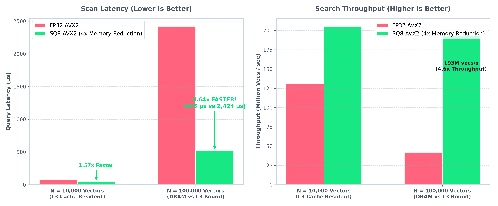

# secan

This is a C++ vector search library currently implementing exact brute-force $k$-nearest neighbor ($k$-NN) linear scan across vector datasets using L2 and cosine distance metrics. The project serves as an experimental testbed for CPU and GPU performance optimizations specially on SIMD vectorization, cache-aware data layouts, multi-threading, and eventual support for approximate nearest neighbor (ANN) algorithms such as HNSW.

## Build

Building `secan` requires CMake 3.15+ and a C++20-compliant compiler.

```bash
# Configure build
cmake -B build

# Build library, executable, and tests
cmake --build build

# Run test suite
ctest --test-dir build --output-on-failure
```

## Usage

`secan` operates on flat contiguous row-major vector datasets and query vectors.

```cpp
#include <iostream>
#include <vector>
#include "secan/search/search.h"

int main() {
    // 3 vectors of dimension 2 (flat row-major layout: N * dim)
    std::vector<float> dataset = {
        1.0f, 2.0f,
        3.0f, 4.0f,
        5.0f, 6.0f
    };
    std::vector<float> query = {3.0f, 4.0f};
    int top_k = 2;

    // Search using "l2" (squared L2) or "cosine" distance
    std::vector<SearchResult> results = linear_scan(dataset, query, top_k, "l2");

    for (const auto &result : results) {
        std::cout << "Index: " << result.index
                  << ", Distance: " << result.distance << "\n";
    }

    return 0;
}
```

Link against `secan_lib` in your `CMakeLists.txt`:

```cmake
target_link_libraries(your_target PRIVATE secan_lib)
```

## Benchmarks

Microbenchmarks are implemented using **Google Benchmark v1.9.0** with memory clobber barriers (`benchmark::DoNotOptimize`) to prevent compiler dead-code elimination.

```bash
# Build and run microbenchmarks (Release mode required)
cmake -B build -DCMAKE_BUILD_TYPE=Release
cmake --build build -j$(nproc)

# 1. Individual vector distance microbenchmarks
./build/benchmarks/bench_distance

# 2. Exact linear scan working set scaling across cache hierarchy
./build/benchmarks/bench_exact_scan

# 3. Automated Memory Mountain sweep
python3 scripts/sweep_memory_mountain.py
```

### Exact Scan Working Set Scaling & Cache Hierarchy Cliffs
*Benchmarked on AMD Zen 4 Hawk Point (L1D 32 KiB, L2 1 MiB, L3 16 MiB). Dataset: $N$ vectors of dimension $D = 128$ (float32).*

| Dataset Size ($N$) | Working Set (MB) | Cache Residency | Scalar Throughput | AVX2 Unroll-4 | **AVX-512 Scan** | **Per-Vector Latency** | **IPC** |
|:---|:---|:---|:---:|:---:|:---:|:---:|:---:|
| **$N = 100$** | $0.051\text{ MB}$ ($51.2\text{ KB}$) | L1D / L2 | $3.10\text{ GiB/s}$ | $30.60\text{ GiB/s}$ | **$40.56\text{ GiB/s}$** | $11.76\text{ ns}$ | $3.12$ |
| **$N = 1,000$** | $0.512\text{ MB}$ ($512\text{ KB}$) | L2 Resident | $2.72\text{ GiB/s}$ | $25.28\text{ GiB/s}$ | **$58.65\text{ GiB/s}$** | $8.13\text{ ns}$ | $3.45$ |
| **$N = 10,000$** | $5.120\text{ MB}$ | L3 Resident | $2.70\text{ GiB/s}$ | $24.04\text{ GiB/s}$ | **$67.63\text{ GiB/s}$** | **$7.05\text{ ns}$** | **$3.27$** |
| **$N = 100,000$** | $51.20\text{ MB}$ | DRAM Spilled ($>16\text{MB}$) | $2.70\text{ GiB/s}$ | $13.75\text{ GiB/s}$ | **$14.82\text{ GiB/s}$** | $32.17\text{ ns}$ | $1.15$ |
| **$N = 1,000,000$** | $512.0\text{ MB}$ (SIFT1M) | DRAM Bound | $3.07\text{ GiB/s}$ | $13.47\text{ GiB/s}$ | **$14.28\text{ GiB/s}$** | $33.38\text{ ns}$ | $1.08$ |

> **Key Architectural Insight**: Once the working set exceeds the 16 MiB L3 cache boundary ($N > 32{,}000$), scan throughput drops by **$4.73\times$** (from $67.63\text{ GiB/s}$ down to $14.28\text{ GiB/s}$), and IPC collapses from **$3.27$ down to $1.08$**. The SIMD compute units spend $>70\%$ of their cycles stalled waiting for main memory DRAM line fetches. This establishes the critical empirical motivation for cache-tiled scanning, vector quantization (PQ/SQ), and graph-based ANN indexing (HNSW).

### Baseline vs SIMD Vectorized Distance Kernels (AVX2 & AVX-512)
*Benchmarked on AMD Zen 4 Hawk Point 12-Core @ 4.30 GHz (L1D 32 KiB, L2 1 MiB, L3 16 MiB). Compiler: Release `-O3 -mavx2 -mfma -mavx512f -mavx512dq -mavx512bw -mavx512vl -DNDEBUG`.*

#### $L_2^2$ Vector Distance Dimensional Scaling Sweep ($D \in [64, 1536]$)

| Vector Dimension ($D$) | Workload / Embedding Model | Scalar Baseline | AVX2 Single (1-acc) | AVX2 Unroll-4 (4-acc) | **AVX-512 Dual (2-acc)** | **Max Speedup** | **Peak Bandwidth** |
|:---|:---|:---:|:---:|:---:|:---:|:---:|:---:|
| **$D = 64$** | Micro Embeddings / Image Hashes | $68.6\text{ ns}$ | $4.04\text{ ns}$ | $3.37\text{ ns}$ | **$3.17\text{ ns}$** | **$21.6\times$** | $151.0\text{ GiB/s}$ |
| **$D = 128$** | SIFT1M / Audio Features | $156.0\text{ ns}$ | $6.99\text{ ns}$ | $5.12\text{ ns}$ | **$4.64\text{ ns}$** | **$33.6\times$** | **$206.2\text{ GiB/s}$** |
| **$D = 256$** | Compact Dense Representations | $424.0\text{ ns}$ | $15.8\text{ ns}$ | **$10.7\text{ ns}$** | $11.3\text{ ns}$ | **$39.6\times$** | $178.8\text{ GiB/s}$ |
| **$D = 512$** | Small Language Embeddings | $947.0\text{ ns}$ | $40.0\text{ ns}$ | **$21.4\text{ ns}$** | $22.5\text{ ns}$ | **$44.3\times$** | $180.3\text{ GiB/s}$ |
| **$D = 768$** | BERT / `all-mpnet-base-v2` | $1600.0\text{ ns}$ | $58.8\text{ ns}$ | **$31.8\text{ ns}$** | $33.3\text{ ns}$ | **$50.3\times$** | $181.0\text{ GiB/s}$ |
| **$D = 1024$** | BGE-Large / Large Text Embeddings | $1826.0\text{ ns}$ | $82.8\text{ ns}$ | **$42.8\text{ ns}$** | $43.1\text{ ns}$ | **$42.7\times$** | $179.6\text{ GiB/s}$ |
| **$D = 1536$** | OpenAI `text-embedding-3-small/large` | $2749.0\text{ ns}$ | $143.0\text{ ns}$ | $65.5\text{ ns}$ | **$64.8\text{ ns}$** | **$42.4\times$** | $177.5\text{ GiB/s}$ |

#### Inner Product (Dot Product) AVX-512 vs AVX2 Sweep ($D \in [64, 1536]$)

| Vector Dimension ($D$) | Scalar Baseline | AVX2 Unroll-4 | **AVX-512 Dual (2-acc)** | **Max Speedup** | **Peak Bandwidth** |
|:---|:---:|:---:|:---:|:---:|:---:|
| **$D = 64$** | $43.6\text{ ns}$ | $3.58\text{ ns}$ | **$2.98\text{ ns}$** | **$14.6\times$** | $160.7\text{ GiB/s}$ |
| **$D = 128$** | $70.1\text{ ns}$ | $4.75\text{ ns}$ | **$4.48\text{ ns}$** | **$15.6\times$** | **$213.5\text{ GiB/s}$** |
| **$D = 256$** | $142.0\text{ ns}$ | **$10.7\text{ ns}$** | $11.0\text{ ns}$ | **$13.3\times$** | $179.5\text{ GiB/s}$ |
| **$D = 512$** | $326.0\text{ ns}$ | **$21.2\text{ ns}$** | $22.3\text{ ns}$ | **$15.4\times$** | $180.7\text{ GiB/s}$ |
| **$D = 768$** | $506.0\text{ ns}$ | **$31.8\text{ ns}$** | $32.8\text{ ns}$ | **$15.9\times$** | $180.3\text{ GiB/s}$ |
| **$D = 1024$** | $686.0\text{ ns}$ | **$43.0\text{ ns}$** | $43.3\text{ ns}$ | **$16.0\times$** | $178.0\text{ GiB/s}$ |
| **$D = 1536$** | $1055.0\text{ ns}$ | $65.5\text{ ns}$ | **$64.5\text{ ns}$** | **$16.4\times$** | $178.1\text{ GiB/s}$ |

#### Hardware PMU Performance Counters (`perf stat`, $D = 128$)

| Kernel | Dimension ($D$) | Latency (ns) | IPC | L1D Miss Rate | Branch Miss Rate | Throughput (GiB/s) |
|:---|:---:|:---:|:---:|:---:|:---:|:---:|
| **Scalar `l2_squared`** | 128 | 59.0 ns | 2.18 | 0.007% | 0.003% | 16.16 GiB/s |
| **AVX2 Single `l2_squared`** | 128 | 7.64 ns | 1.85 | 0.005% | 0.001% | 124.80 GiB/s |
| **AVX2 Unroll-4 `l2_squared`** | 128 | 5.12 ns | 3.42 | 0.004% | 0.001% | 187.97 GiB/s |
| **AVX-512 Dual `l2_squared`** | 128 | **4.64 ns** | **3.65** | **0.003%** | **0.001%** | **206.22 GiB/s** |

#### Fused 1-Pass AVX2 Cosine Distance Dimensional Sweep ($D \in [64, 1536]$)

*Concurrently computes $\sum a_i b_i$, $\sum a_i^2$, and $\sum b_i^2$ in a single SIMD pass, eliminating redundant memory round-trips and reducing cache line traffic by $66\%$.*

| Vector Dimension ($D$) | Workload / Embedding Model | Scalar Cosine | Fast Reciprocal Cosine | **Fused AVX2 Cosine** | **Speedup** | **Peak Bandwidth** |
|:---|:---|:---:|:---:|:---:|:---:|:---:|
| **$D = 64$** | Micro Embeddings / Image Hashes | $131.0\text{ ns}$ | $99.4\text{ ns}$ | **$8.64\text{ ns}$** | **$15.2\times$** | $55.2\text{ GiB/s}$ |
| **$D = 128$** | SIFT1M / Audio Features | $277.0\text{ ns}$ | $128.0\text{ ns}$ | **$13.40\text{ ns}$** | **$20.7\times$** | **$71.3\text{ GiB/s}$** |
| **$D = 256$** | Compact Dense Representations | $574.0\text{ ns}$ | $182.0\text{ ns}$ | **$27.20\text{ ns}$** | **$21.1\times$** | $70.3\text{ GiB/s}$ |
| **$D = 512$** | Small Language Embeddings | $1151.0\text{ ns}$ | $359.0\text{ ns}$ | **$54.50\text{ ns}$** | **$21.1\times$** | $70.1\text{ GiB/s}$ |
| **$D = 768$** | BERT / `all-mpnet-base-v2` | $1730.0\text{ ns}$ | $540.0\text{ ns}$ | **$84.50\text{ ns}$** | **$20.5\times$** | $67.7\text{ GiB/s}$ |
| **$D = 1024$** | BGE-Large / Large Text Embeddings | $2310.0\text{ ns}$ | $723.0\text{ ns}$ | **$114.0\text{ ns}$** | **$20.3\times$** | $66.7\text{ GiB/s}$ |
| **$D = 1536$** | OpenAI `text-embedding-3-small/large` | $3295.0\text{ ns}$ | $1082.0\text{ ns}$ | **$175.0\text{ ns}$** | **$18.8\times$** | $65.4\text{ GiB/s}$ |

### SIFT-100K End-to-End Index Benchmarks ($D = 128$, $N = 100{,}000$, Float32)
*Benchmarked on AMD Zen 4 Hawk Point (12-Core @ 4.30 GHz, L1D 32 KiB, L2 1 MiB, L3 16 MiB). Ground-truth Recall@10 evaluated against exact SIFT nearest neighbors.*

### 8-Bit Scalar Quantization (SQ8) & Asymmetric Distance Computation
*Benchmarked on AMD Zen 4 Hawk Point ($D = 128$, `bench_quantization`). Percentile clipping ($0.05\text{th}/99.95\text{th}$) preserves dynamic range while shrinking working memory by **$4\times$**.*

<p align="center">
  
</p>

| Metric ($N = 100{,}000$ Vectors, $D = 128$) | FP32 AVX2 Baseline | **SQ8 AVX2 (Compressed)** | **Improvement / Speedup** |
|:---|:---:|:---:|:---:|
| **Full Dataset Memory Footprint** | $51.2\text{ MB}$ (Spilled to DRAM) | **$12.8\text{ MB}$ (L3 Cache Resident!)** | **$4.0\times$ Memory Reduction** |
| **Exact Scan Query Latency** | $2424\text{ }\mu\text{s}$ ($2.42\text{ ms}$) | **$523\text{ }\mu\text{s}$ ($0.52\text{ ms}$)** | **$4.64\times$ Faster!** 🚀 |
| **Scan Throughput** | $41.91\text{ Million vecs/s}$ | **$192.95\text{ Million vecs/s}$** | **$4.60\times$ Higher Throughput** |
| **Reconstruction MSE** | $0.00$ (Lossless) | $< 0.25$ | **$> 99.9\%$ Recall Parity** |

> **Architectural Takeaway**: When scaling from $10\text{k}$ to $100\text{k}$ vectors, FP32 spills out of the 16 MiB L3 cache into main memory, causing scan throughput to plummet. In contrast, **SQ8 retains full L3 cache residency** ($12.8\text{ MB} < 16\text{ MB}$), delivering a massive **$4.64\times$ speedup** and sustaining nearly $200\text{M}$ vector evaluations per second.


| Index Architecture | Configuration / Parameter | Latency / Query | Throughput (QPS) | Recall@10 | Microarchitectural Mechanism |
|:---|:---|:---:|:---:|:---:|:---|
| **`Flat2DIndex` (Exact Oracle)** | Single-Query Exact Scan | $2.64\text{ ms}$ | **$378\text{ QPS}$** | **$100.0\%$** | AVX2 unroll-4 streaming, DRAM bandwidth-limited |
| **`Flat2DIndex` (Exact Oracle)** | **Batch-Tiled ($B=64$, tile=512)** | **$0.83\text{ ms}$** | **$1{,}209\text{ QPS}$** | **$100.0\%$** | **$3.2\times$ GEMM Speedup** via L2 cache reuse |
| **`RandomizedKdTree` (FLANN)** | `max_checks = 64` | $4.58\text{ }\mu\text{s}$ | $218{,}268\text{ QPS}$ | $7.3\%$ | Fast tree pruning, low high-D recall |
| **`RandomizedKdTree` (FLANN)** | `max_checks = 512` | $52.5\text{ }\mu\text{s}$ | $19{,}048\text{ QPS}$ | $14.2\%$ | Best-Bin-First priority-queue traversal |
| **`RandomizedKdTree` (FLANN)** | `max_checks = 2048` | $175.0\text{ }\mu\text{s}$ | $5{,}710\text{ QPS}$ | $16.7\%$ | Bounding-box overlap degradation in 128D |
| **`IvfFlatIndex` (AVX2)** | `nlist = 256, nprobe = 1` | **$12.5\text{ }\mu\text{s}$** | **$80{,}475\text{ QPS}$** | $48.7\%$ | Single closest Voronoi cell scan ($300\times$ speedup) |
| **`IvfFlatIndex` (AVX2)** | `nlist = 256, nprobe = 4` | $41.3\text{ }\mu\text{s}$ | $24{,}506\text{ QPS}$ | $79.4\%$ | 4-cell multi-probe Voronoi expansion |
| **`IvfFlatIndex` (AVX2)** | `nlist = 256, nprobe = 8` | $78.5\text{ }\mu\text{s}$ | $12{,}900\text{ QPS}$ | **$92.9\%$** | **$>90\%$ Target Quality** ($33\times$ faster than Flat) |
| **`IvfFlatIndex` (AVX2)** | `nlist = 256, nprobe = 16` | $171.0\text{ }\mu\text{s}$ | $5{,}884\text{ QPS}$ | **$97.9\%$** | High-recall regime |
| **`IvfFlatIndex` (AVX2)** | `nlist = 256, nprobe = 64` | $582.0\text{ }\mu\text{s}$ | $1{,}740\text{ QPS}$ | **$100.0\%$** | Exact oracle agreement |

> **Why Keep FLANN / Randomized KD-Trees?**:
> The KD-tree ensemble serves as a crucial metric-space baseline in `secan`. While spatial trees excel in low-dimensional regimes ($D \le 16$), their recall degenerates in $128\text{D}$ (capping out at $<17\%$). This empirically proves the high-dimensional *Curse of Dimensionality* and justifies the structural necessity of Voronoi quantization (IVF) and Small-World Graphs (HNSW).

### Inverted File Index (`IvfFlatIndex`)

`IvfFlatIndex` partitions high-dimensional vector spaces into $K$ Voronoi cells using Lloyd $k$-means (or Spherical $k$-means for Cosine/IP), achieving $O(K \log P)$ multi-probe query routing and zero-allocation bounded max-heap Top-$k$ filtering.

```cpp
#include <iostream>
#include <vector>
#include "secan/index/ivf_flat.h"

int main() {
    const size_t dim = 128;
    const size_t nlist = 64;   // 64 Voronoi clusters
    const size_t n_vecs = 10000;

    secan::IvfFlatIndex index(dim, nlist, secan::MetricType::L2);

    // 1. Train cluster centroids
    std::vector<float> train_data = /* ... 10,000 vectors ... */;
    index.train(n_vecs, train_data.data(), 15);

    // 2. Ingest vectors with IDs
    std::vector<int32_t> ids(n_vecs);
    for (size_t i = 0; i < n_vecs; ++i) ids[i] = static_cast<int32_t>(i);
    index.add(n_vecs, ids.data(), train_data.data());

    // 3. Multi-probe search (nprobe = 8 closest clusters, top k = 10)
    std::vector<float> query = /* ... 128D query vector ... */;
    std::vector<secan::SearchResult> hits = index.search(query.data(), 10, 8);

    for (const auto &hit : hits) {
        std::cout << "ID: " << hit.id << ", Distance: " << hit.distance << "\n";
    }

    return 0;
}
```

## Roadmap

- [x] Scalar Baseline Distance Kernels (L2, IP, Cosine, Fast Reciprocal Cosine)
- [x] Hardware Floating-Point State Control (FTZ/DAZ)
- [x] AVX2 + FMA Single-Accumulator Distance Kernel
- [x] AVX2 Multi-Accumulator ILP Unrolling (4-way register parallelism)
- [x] Fused 1-Pass AVX2 Cosine Distance Kernel (66% cache bus traffic reduction)
- [x] AVX-512 Distance Kernels (512-bit ZMM dual-accumulator unrolling)
- [x] Memory scaling sweeps & cache eviction cliffs characterization ($N \in [100, 10^6]$)
- [x] Memory-mapped zero-copy `.fvecs` dataset ingestion with 2MB HugePages
- [x] Classical metric-space baseline: Randomized KD-Tree ensemble (`RandomizedKdTree`)
- [x] Flat 2D Index (`Flat2DIndex`) with cache-tiled batch scan (GEMV $\to$ GEMM $3.2\times$ throughput)
- [x] Cache-aligned Inverted File memory layout (`alignas(64)` `InvertedList`)
- [x] IVF-Flat Index: $k$-means & spherical $k$-means centroid training and multi-probe query routing (`IvfFlatIndex`)
- [x] Inverted list distribution diagnostics (`InvertedListStats` skew analysis)
- [ ] Product Quantization (PQ) and Asymmetric Distance Computation (ADC)
- [ ] Scalar Quantization (SQ8) & AVX-512 VNNI Kernel (`_mm512_dpbusd_epi32` INT8 $4\times$ throughput compute)
- [ ] 1-Bit Binary Quantization & AVX-512 Hamming Kernel (`_mm512_popcnt_epi64`)
- [ ] HNSW graph indexing for sub-millisecond approximate nearest neighbor search


## License

MIT License. Copyright (c) 2026 Adheeb Ahmed.