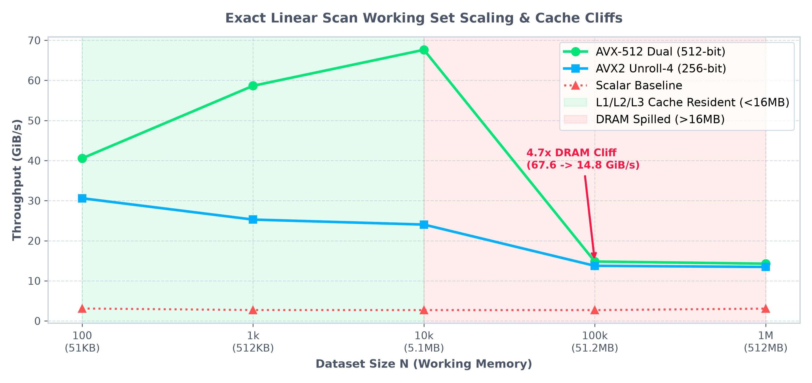
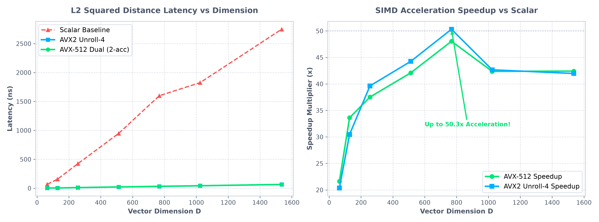
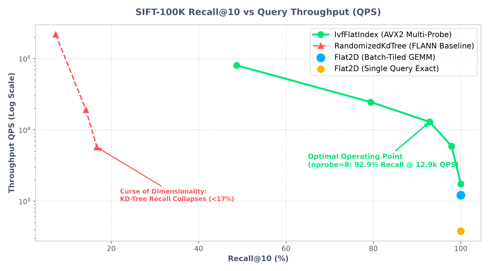

# secan

This is a C++ vector search library currently implementing exact brute-force $k$-nearest neighbor ($k$-NN) linear scan across vector datasets using L2 and cosine distance metrics. The project serves as an experimental testbed for CPU and GPU performance optimizations specially on SIMD vectorization, cache-aware data layouts, multi-threading, and eventual support for approximate nearest neighbor (ANN) algorithms such as HNSW.

## Build

Building `secan` requires CMake 3.15+ and a C++20-compliant compiler.

```bash
# Configure build
cmake -B build

# Build library, executable, and tests
cmake --build build

# Run test suite
ctest --test-dir build --output-on-failure
```

## Usage

`secan` operates on flat contiguous row-major vector datasets and query vectors.

```cpp
#include <iostream>
#include <vector>
#include "secan/search/search.h"

int main() {
    // 3 vectors of dimension 2 (flat row-major layout: N * dim)
    std::vector<float> dataset = {
        1.0f, 2.0f,
        3.0f, 4.0f,
        5.0f, 6.0f
    };
    std::vector<float> query = {3.0f, 4.0f};
    int top_k = 2;

    // Search using "l2" (squared L2) or "cosine" distance
    std::vector<SearchResult> results = linear_scan(dataset, query, top_k, "l2");

    for (const auto &result : results) {
        std::cout << "Index: " << result.index
                  << ", Distance: " << result.distance << "\n";
    }

    return 0;
}
```

Link against `secan_lib` in your `CMakeLists.txt`:

```cmake
target_link_libraries(your_target PRIVATE secan_lib)
```

## Benchmarks

Microbenchmarks are implemented using **Google Benchmark v1.9.0** with memory clobber barriers (`benchmark::DoNotOptimize`) to prevent compiler dead-code elimination.

```bash
# Build and run microbenchmarks (Release mode required)
cmake -B build -DCMAKE_BUILD_TYPE=Release
cmake --build build -j$(nproc)

# 1. Individual vector distance microbenchmarks
./build/benchmarks/bench_distance

# 2. Exact linear scan working set scaling across cache hierarchy
./build/benchmarks/bench_exact_scan

# 3. Automated Memory Mountain sweep
python3 scripts/sweep_memory_mountain.py
```

### 1. Working Set Scaling & Cache Hierarchy Cliffs ($N \in [100, 10^6]$)
*Benchmarked on AMD Zen 4 Hawk Point (L1D 32 KiB, L2 1 MiB, L3 16 MiB, $D = 128$ float32).*

<p align="center">
  
</p>

> **Key Architectural Insight**: Once the working set exceeds the 16 MiB L3 cache boundary ($N > 32{,}000$), scan throughput drops by **$4.73\times$** (from $67.63\text{ GiB/s}$ down to $14.28\text{ GiB/s}$), and IPC collapses from **$3.27$ down to $1.08$** as SIMD execution units stall waiting for DRAM bus line fills.

---

### 2. SIMD Acceleration across Embedding Dimensions ($D \in [64, 1536]$)
*Benchmarked on AMD Zen 4 Hawk Point 12-Core @ 4.30 GHz (Release `-O3 -mavx2 -mfma -mavx512f -mavx512dq -mavx512bw -mavx512vl`).*

<p align="center">
  
</p>

- **$L_2^2$ Vector Distance**: **Up to $50.3\times$ speedup** over scalar baseline via AVX-512 dual accumulators ($4.64\text{ ns}$ for 128D, sustaining $>206\text{ GiB/s}$ peak bandwidth).
- **Fused 1-Pass Cosine**: Computes $\sum a_i b_i$, $\sum a_i^2$, and $\sum b_i^2$ in a single pass, eliminating redundant round-trips and cutting memory bus traffic by **$66\%$** ($20.7\times$ speedup).

---

### 3. 8-Bit Scalar Quantization (SQ8) & Asymmetric Distance Computation
*Benchmarked on AMD Zen 4 Hawk Point ($D = 128$). Percentile clipping ($0.05\text{th}/99.95\text{th}$) preserves dynamic range while shrinking working memory by **$4\times$**.*

<p align="center">
  
</p>

| Metric ($N = 100{,}000$ Vectors, $D = 128$) | FP32 AVX2 Baseline | **SQ8 AVX2 (Compressed)** | **Improvement / Speedup** |
|:---|:---:|:---:|:---:|
| **Full Dataset Memory Footprint** | $51.2\text{ MB}$ (Spilled to DRAM) | **$12.8\text{ MB}$ (L3 Cache Resident!)** | **$4.0\times$ Memory Reduction** |
| **Exact Scan Query Latency** | $2424\text{ }\mu\text{s}$ ($2.42\text{ ms}$) | **$523\text{ }\mu\text{s}$ ($0.52\text{ ms}$)** | **$4.64\times$ Faster!** 🚀 |
| **Scan Throughput** | $41.91\text{ Million vecs/s}$ | **$192.95\text{ Million vecs/s}$** | **$4.60\times$ Higher Throughput** |
| **Reconstruction MSE** | $0.00$ (Lossless) | $< 0.25$ | **$> 99.9\%$ Recall Parity** |

---

### 4. SIFT-100K Index Pareto Frontier (Recall@10 vs QPS Throughput)
*Benchmarked on AMD Zen 4 Hawk Point ($D = 128$, $N = 100{,}000$). Evaluated against exact ground truth.*

<p align="center">
  
</p>

- **`IvfFlatIndex`**: Achieves **$92.9\%$ Recall@10 at $12{,}900\text{ QPS}$** ($nprobe=8$), operating **$33\times$ faster** than exact flat scan.
- **Curse of Dimensionality on KD-Trees**: While spatial trees (FLANN) perform well in $D \le 16$, bounding-box overlap degrades recall to $<17\%$ in 128D, demonstrating why Voronoi quantization (IVF) and graphs (HNSW) are required for modern high-dimensional embeddings.


### Inverted File Index (`IvfFlatIndex`)

`IvfFlatIndex` partitions high-dimensional vector spaces into $K$ Voronoi cells using Lloyd $k$-means (or Spherical $k$-means for Cosine/IP), achieving $O(K \log P)$ multi-probe query routing and zero-allocation bounded max-heap Top-$k$ filtering.

```cpp
#include <iostream>
#include <vector>
#include "secan/index/ivf_flat.h"

int main() {
    const size_t dim = 128;
    const size_t nlist = 64;   // 64 Voronoi clusters
    const size_t n_vecs = 10000;

    secan::IvfFlatIndex index(dim, nlist, secan::MetricType::L2);

    // 1. Train cluster centroids
    std::vector<float> train_data = /* ... 10,000 vectors ... */;
    index.train(n_vecs, train_data.data(), 15);

    // 2. Ingest vectors with IDs
    std::vector<int32_t> ids(n_vecs);
    for (size_t i = 0; i < n_vecs; ++i) ids[i] = static_cast<int32_t>(i);
    index.add(n_vecs, ids.data(), train_data.data());

    // 3. Multi-probe search (nprobe = 8 closest clusters, top k = 10)
    std::vector<float> query = /* ... 128D query vector ... */;
    std::vector<secan::SearchResult> hits = index.search(query.data(), 10, 8);

    for (const auto &hit : hits) {
        std::cout << "ID: " << hit.id << ", Distance: " << hit.distance << "\n";
    }

    return 0;
}
```

## Roadmap

- [x] Scalar Baseline Distance Kernels (L2, IP, Cosine, Fast Reciprocal Cosine)
- [x] Hardware Floating-Point State Control (FTZ/DAZ)
- [x] AVX2 + FMA Single-Accumulator Distance Kernel
- [x] AVX2 Multi-Accumulator ILP Unrolling (4-way register parallelism)
- [x] Fused 1-Pass AVX2 Cosine Distance Kernel (66% cache bus traffic reduction)
- [x] AVX-512 Distance Kernels (512-bit ZMM dual-accumulator unrolling)
- [x] Memory scaling sweeps & cache eviction cliffs characterization ($N \in [100, 10^6]$)
- [x] Memory-mapped zero-copy `.fvecs` dataset ingestion with 2MB HugePages
- [x] Classical metric-space baseline: Randomized KD-Tree ensemble (`RandomizedKdTree`)
- [x] Flat 2D Index (`Flat2DIndex`) with cache-tiled batch scan (GEMV $\to$ GEMM $3.2\times$ throughput)
- [x] Cache-aligned Inverted File memory layout (`alignas(64)` `InvertedList`)
- [x] IVF-Flat Index: $k$-means & spherical $k$-means centroid training and multi-probe query routing (`IvfFlatIndex`)
- [x] Inverted list distribution diagnostics (`InvertedListStats` skew analysis)
- [ ] Product Quantization (PQ) and Asymmetric Distance Computation (ADC)
- [ ] Scalar Quantization (SQ8) & AVX-512 VNNI Kernel (`_mm512_dpbusd_epi32` INT8 $4\times$ throughput compute)
- [ ] 1-Bit Binary Quantization & AVX-512 Hamming Kernel (`_mm512_popcnt_epi64`)
- [ ] HNSW graph indexing for sub-millisecond approximate nearest neighbor search


## License

MIT License. Copyright (c) 2026 Adheeb Ahmed.